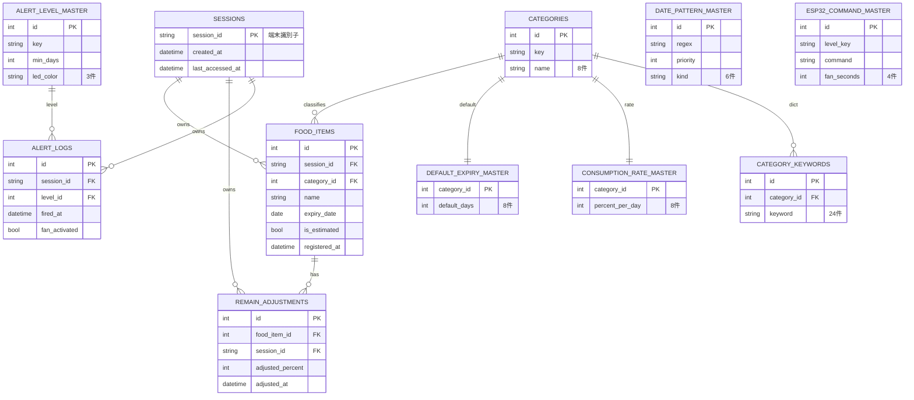
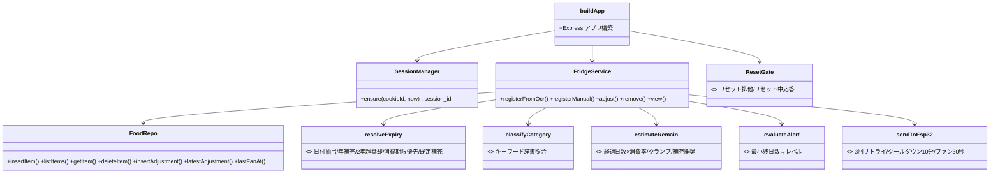
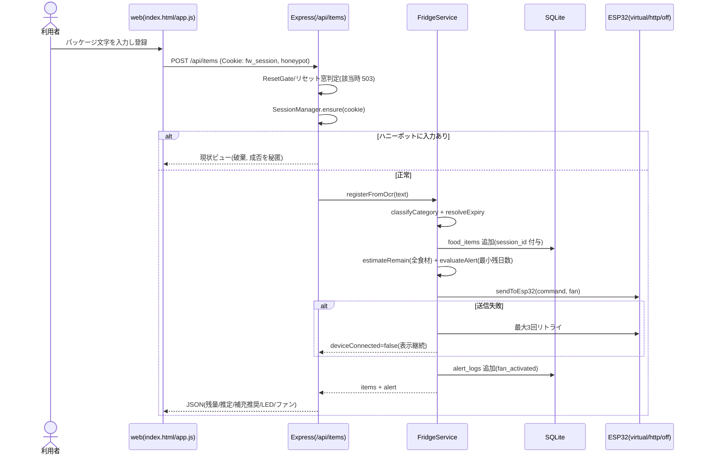
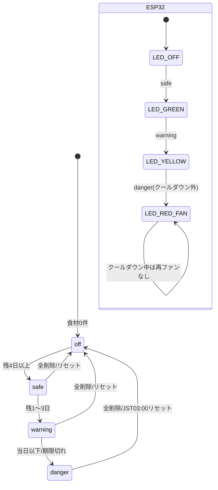

# リバースエンジニアリング図(実装追随)

コードを正とした図。対象コミット: フィーチャーブランチ `feat/demo-core-f1-f4`(F1〜F4 デモ実装)。
実装スタックは環境制約により **TypeScript(Node.js)フルスタック**へ差し替え(理由は `../WORK/2026-07-07-demo-core-implementation.md` / `../ENV/DEVELOPMENT.md`)。
ドメインロジック(F1〜F4)の判定仕様は正本設計に完全準拠する。

## 1. ER 図(実装テーブル)

マスタ合計 8+8+8+24+6+3+4 = **61 件**(`src/config/masters.json`、`test/unit/seed.test.ts` で担保)。

## 2. コンポーネント / クラス図(実装モジュール)

## 3. シーケンス図(食材登録〜ESP32制御)

## 4. 状態遷移図(アラートレベル + デバイス)

## 5. API 一覧

| メソッド | パス | 概要 |
|---|---|---|
| GET | `/api/state` | 自セッションの一覧+残量+アラート |
| POST | `/api/items` | OCR文字から登録(F1)。空文字は `needManual` |
| POST | `/api/items/manual` | 手動登録(OCR失敗フォールバック) |
| POST | `/api/items/:id/adjust` | 残量手動補正(F2)。他セッションは404 |
| DELETE | `/api/items/:id` | 削除。他セッションは404 |
| POST | `/api/reset` | 手動リセット(自セッションのみ削除)。全セッション全削除は JST03:00 スケジューラのみ |
| GET | `/api/masters` | カテゴリ/対応言語/RTL言語 |
| GET | `/api/device` | 仮想デバイス状態(LED/ファン) |

全 `/api` はセッションIDスコープで動作し、日次リセット中は 503 `resetting` を返す。
