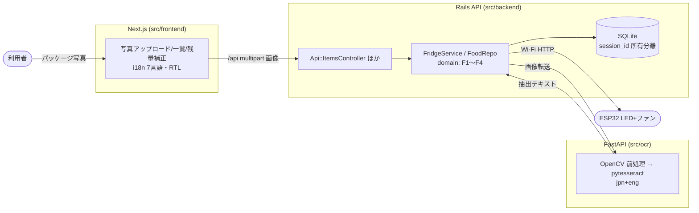
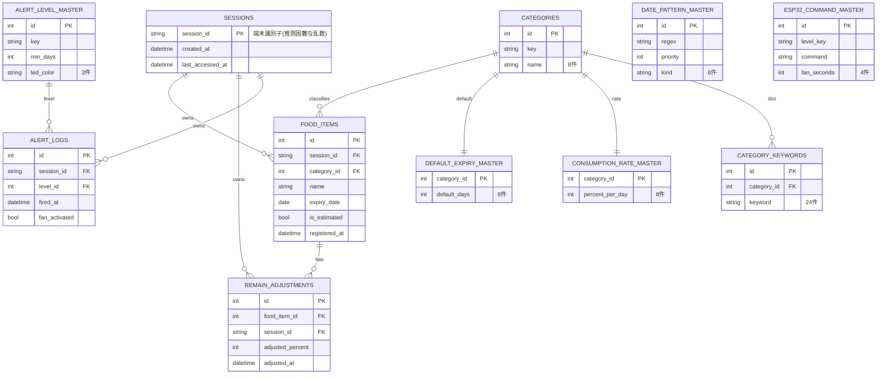
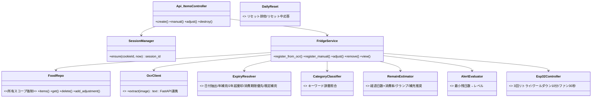
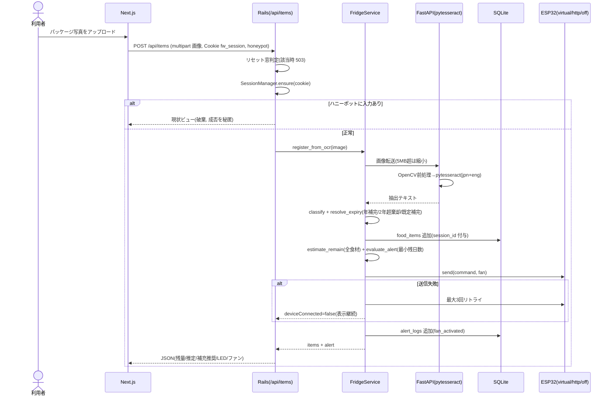
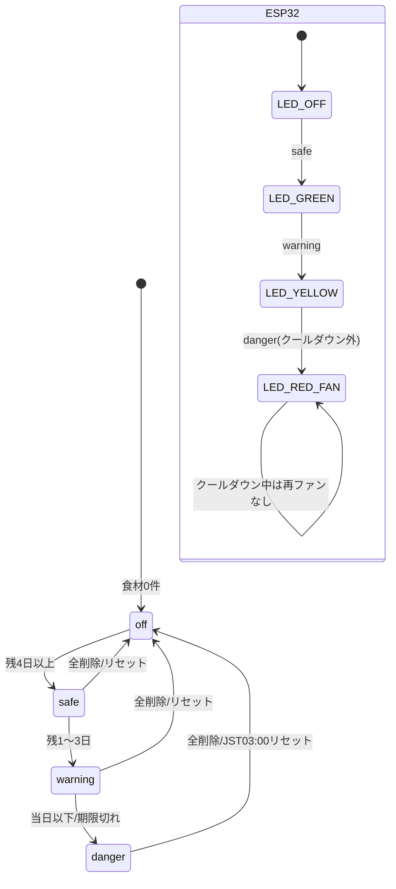

# リバースエンジニアリング図(実装追随)

コードを正とした図。対象ブランチ: `feat/rebuild-canonical-stack`。
実装スタックは**正本設計 §1.3 に完全準拠**する3層構成へ再構築した:

- フロントエンド: **Next.js**(`src/frontend/`、App Router / TypeScript、7言語 i18n・ar は RTL)
- バックエンド: **Ruby on Rails(API モード)**(`src/backend/`、SQLite、認証なし)
- 画像解析 OCR: **FastAPI + pytesseract + OpenCV**(`src/ocr/`、ローカル tesseract のみ・外部API不使用)
- DB: **SQLite**(デモ版指定)

ドメインロジック(F1〜F4)の判定仕様は正本設計に完全準拠する。

## 1. システム構成図(3層 + デバイス)

## 2. ER 図(実装テーブル)

マスタ合計 8+8+8+24+6+3+4 = **61 件**(`src/backend/db/seeds.rb` が `config/masters.json` から冪等投入)。

## 3. クラス図(Rails ドメイン/サービス)

## 4. シーケンス図(写真登録〜OCR〜ESP32制御)

## 5. 状態遷移図(アラートレベル + デバイス)

## 6. API 一覧(Rails)

| メソッド | パス | 概要 |
|---|---|---|
| GET | `/api/state` | 自セッションの一覧+残量+アラート |
| POST | `/api/items` | 写真(multipart)→OCR→登録(F1)。`ocrText` 直接入力も可。空は `needManual` |
| POST | `/api/items/manual` | 手動登録(OCR失敗フォールバック) |
| POST | `/api/items/:id/adjust` | 残量手動補正(F2)。他セッションは404 |
| DELETE | `/api/items/:id` | 削除。他セッションは404 |
| POST | `/api/reset` | 手動リセット(自セッションのみ削除)。全セッション全削除は JST03:00 のみ |
| GET | `/api/masters` | カテゴリ/対応言語/RTL言語 |
| GET | `/api/device` | 仮想デバイス状態(LED/ファン) |

全 `/api` はセッションIDスコープで動作し、日次リセット中は 503 `resetting` を返す。
