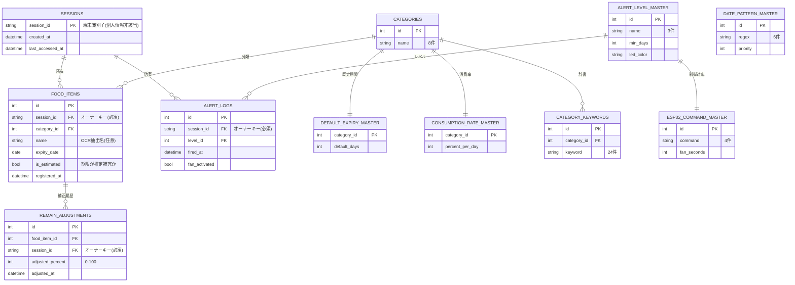
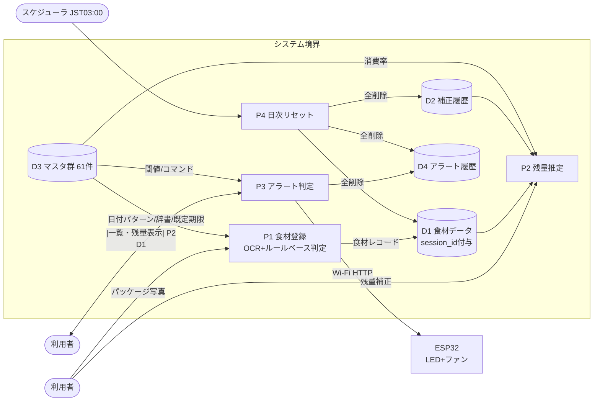
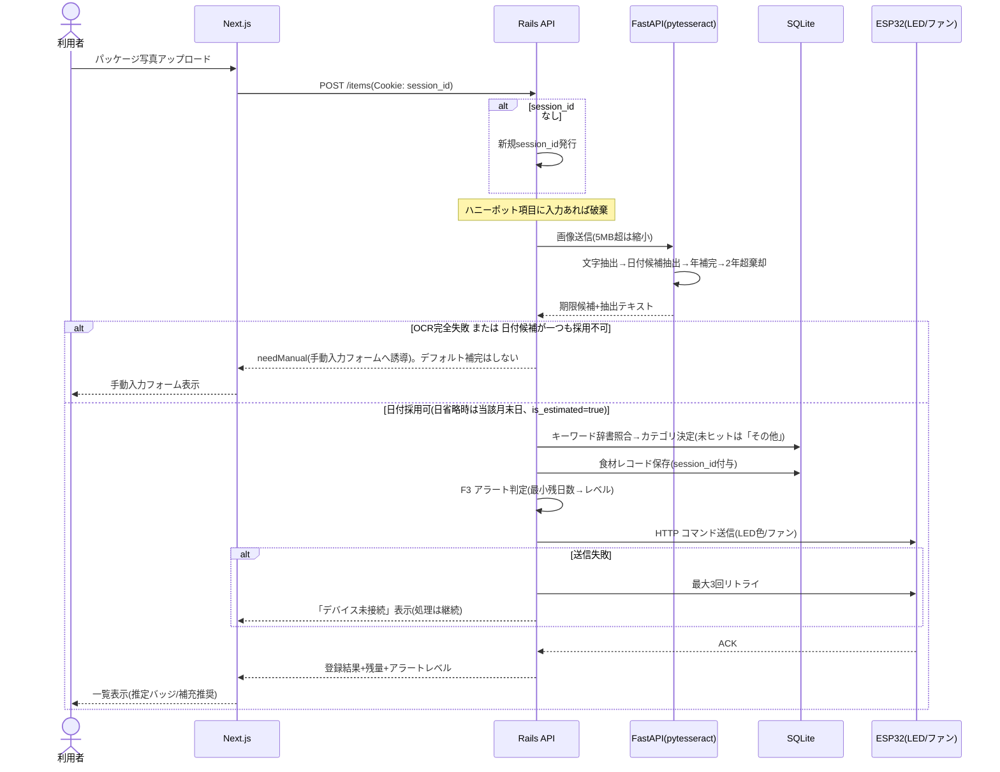
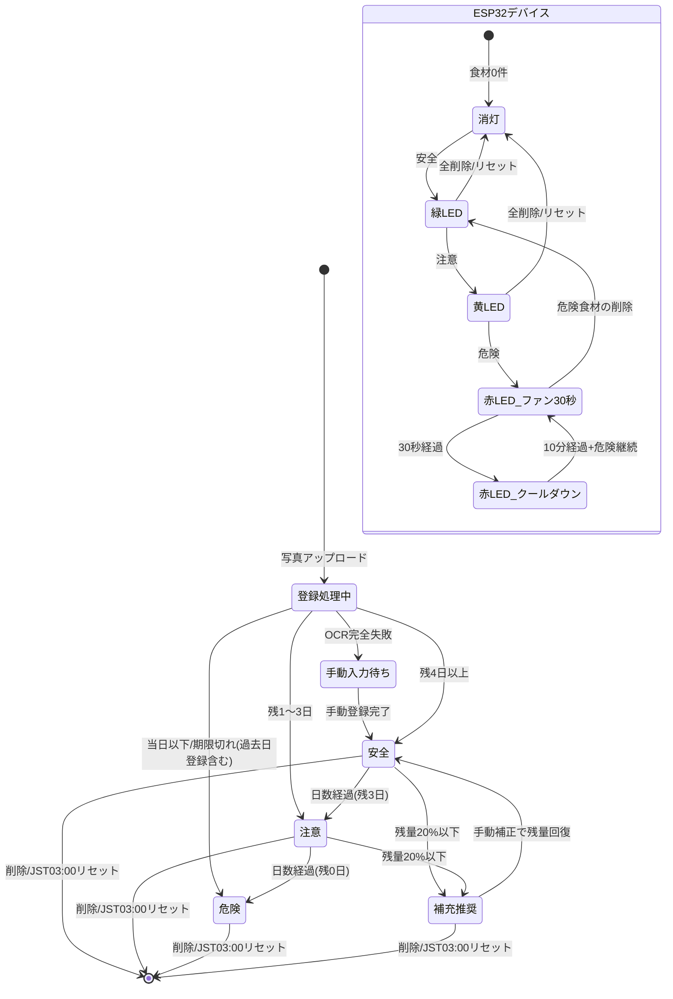
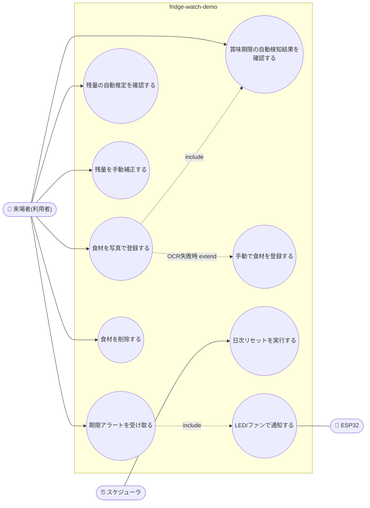

# fridge-watch-demo 設計資料

**製品名:** スマート冷蔵庫管理(食材残量・賞味期限 自動検知)
**対象エディション:** デモ版(アイデアの視覚化)
**リポジトリ名:** `fridge-watch-demo`
**作成日:** 2026-07-07

---

## 1. 仕様書

### 1.1 目的

冷蔵庫内の食材について「賞味期限」と「残量」を自動検知し、期限接近をLED・ファン(ESP32)と画面で知らせる体験を展示物として提供する。技術・UXの体験が目的であり、本番運用は対象外。

### 1.2 課題分類とプラットフォーム選定

- 課題分類: **IoT該当** → ESP32 + LED + ファン を実装
- ソフトウェアプラットフォーム: **ウェブ**(展示会場で来場者の複数端末から手軽に体験可能なため)
- ESP32通信方式: **Wi-Fi**(テザリング可)。ネットワーク越しの外部API呼び出しには該当せず、デモ版でも使用可

### 1.3 技術スタック

| レイヤ | 技術 |
|---|---|
| フロントエンド | Next.js |
| バックエンド | Ruby on Rails(API) |
| 画像解析 | FastAPI + pytesseract + OpenCV(ローカルライブラリのみ、外部API不使用) |
| DB | SQLite(デモ版はデプロイ先を問わずSQLite) |
| ハードウェア | ESP32 + LED(緑/黄/赤) + ファン、Wi-Fi(HTTP)通信 |
| デプロイ | フロント: Vercel(無料) / バックエンド: Railway(無料、不可時のみRender) |

### 1.4 実装方式(デモ版制約)

- 1issueのワンショット実装(`claude --dangerously-skip-permissions` でセキュリティレビューをスキップ)
- 外部API・APIキーが必要なサービスは一切使用しない
- ユーザー認証・認可なし。セッション管理(Cookie + SQLite)のみ
- **セッションIDを全テーブルのオーナーキーとして付与し、セッションをまたいだデータの参照・操作を禁止**(認証なしでも他ユーザーのデータは見えない)
- DBは毎日 JST 03:00 に自動リセット(トランザクションデータのみ削除、マスタは保持)
- Bot対策はハニーポット方式(登録フォームに不可視フィールドを設置し、入力があれば破棄)
- AI機能は不使用。OCR(pytesseract)+ルールベースで代替

### 1.5 個人情報の取り扱い

デモ版方針に準拠し、特定の個人を識別できる情報は一切保持しない。

- 氏名・ニックネーム・メールアドレス・住所・電話番号・生年月日: **使用しない**
- セッションIDは端末識別子として扱い、個人情報には該当しないと整理する
- 保持するのは食材情報とセッションIDのみ

### 1.6 機能仕様

#### F1: 食材登録(賞味期限・カテゴリ自動検知)

1. 利用者がパッケージ写真をアップロードする(5MB超はサーバ側で縮小)
2. FastAPIがpytesseractで文字抽出し、日付パターンマスタの正規表現で日付候補を抽出する
3. 「消費期限」近傍の日付を最優先、なければ**最も未来の日付**を賞味期限として採用する
4. 年省略表記(`07.20`)は「今日以降で最も近い未来日」として年を補完する(年跨ぎ対応)
5. 日省略表記(`2028.04` / `2028年4月`)は**当該月の末日**を賞味期限とし、UIに「推定」バッジを表示する
6. 今日から**2年超先の日付は誤読として棄却**する
7. 抽出文字列をカテゴリキーワード辞書と照合してカテゴリを決定する(未ヒット時は「その他」)
8. **OCR完全失敗時、または日付候補が一つも採用できない場合は手動入力フォームへ誘導する**(needManual)。カテゴリ別デフォルト期限による自動補完は行わない(誤った日付を無言で登録しないため)
9. 期限が過去日でも登録は許可し、即時アラート対象とする
10. セッションID不在時は処理冒頭で新規発行する。レコードにはセッションIDを必ず付与する

#### F2: 残量推定(ルールベース)

1. 残量% = 基準残量 −(基準時刻からの経過日数 × カテゴリ別日次消費率)
2. 基準は最新の手動補正(値・時刻)、補正がなければ登録時(100%)
3. 結果は0〜100%にクランプ。補正入力も0〜100%にクランプ
4. 端末時刻異常(基準時刻より過去)の場合は基準残量をそのまま表示する
5. 残量20%以下で「補充推奨」フラグを立てる

#### F3: アラート判定・ESP32制御

1. セッション内全食材の残日数を計算し、最小残日数でレベルを決定する
   - 安全(残4日以上)= 緑LED / 注意(残1〜3日)= 黄LED / 危険(当日以下・期限切れ)= 赤LED
2. 危険レベル発生時、ファンを30秒作動(換気デモ)。クールダウン10分で重複起動を防止する
3. ESP32へWi-Fi(HTTP)でコマンド送信。失敗時は3回リトライ後スキップし、UIに「デバイス未接続」を表示して画面表示は継続する
4. 食材0件時は消灯コマンドを送る

#### F4: 日次リセット

1. JST 03:00にトランザクションデータ(食材・補正履歴・アラート履歴・セッション)を全削除する
2. マスタデータは保持する
3. リセット実行中のアクセスには「リセット中」応答を返す

### 1.7 マスタデータ件数(デモ版)

| マスタ | 件数 | 内容 |
|---|---|---|
| カテゴリマスタ | **8件** | 乳製品/肉/魚介/野菜/果物/卵/調味料/その他 |
| デフォルト賞味期限マスタ | **8件** | カテゴリごとの補完日数(例: 乳製品5日、野菜7日、調味料180日)。※F1のOCRフォールバックには使用しない(§1.6 F1-8) |
| 日次消費率マスタ | **8件** | カテゴリごとの残量減少率(例: 乳製品20%/日、調味料1%/日) |
| 日付抽出パターンマスタ | **9件** | YYYY.MM.DD / YYYY年MM月DD日 / YY.MM.DD / MM.DD / YYYY-MM-DD / 消費期限接頭パターン / YYYY.MM(日省略) / YYYY年MM月(日省略) / 消費期限接頭(日省略) |
| カテゴリキーワード辞書 | **24件** | 各カテゴリ3語(例: 牛乳・ミルク・ヨーグルト→乳製品) |
| アラートレベルマスタ | **3件** | 安全/注意/危険(閾値・LED色) |
| ESP32制御コマンドマスタ | **4件** | 緑点灯/黄点灯/赤点灯+ファン/消灯 |
| **合計** | **64件** | |

> **注記: デモ版は最小単位のデータでしかテストできない。** 上記マスタは動作体験に必要な最小構成であり、テスト(全48ケース)も食材1〜3件・単一セッション規模の最小単位データで実施している。大量データ・多数同時セッション・長期運用での検証はMVP以降の対象とする。

### 1.8 テスト結果サマリ

| 関数 | ケース数 | 最終結果 |
|---|---|---|
| F1 食材登録 | 16 | 全通過(v3) |
| F2 残量推定 | 12 | 全通過(v2) |
| F3 アラート・ESP32制御 | 14 | 全通過(v3) |
| F4 日次リセット | 6 | 全通過(v1) |
| **合計 / 課題解決度** | **48** | **100%** |

---

## 2. ER図

---

## 3. DFD(データフロー図)

---

## 4. シーケンス図(食材登録〜ESP32制御)

---

## 5. クラス図

```mermaid
classDiagram
    class SessionManager {
        +ensure_session(cookie) session_id
        +scope(session_id) QueryScope
    }
    class FoodItemRegistrar {
        -OcrClient ocr
        -ExpiryResolver resolver
        -CategoryClassifier classifier
        +register(image, session_id) FoodItem
        +register_manual(params, session_id) FoodItem
    }
    class OcrClient {
        +extract_text(image) string
        -shrink_if_over_5mb(image) image
    }
    class ExpiryResolver {
        -DatePatternMaster patterns
        -DefaultExpiryMaster defaults
        +resolve(text, category) date
        -complete_year(md_date) date
        -reject_over_2years(date) bool
        -prefer_shomikigen(candidates) date
    }
    class CategoryClassifier {
        -CategoryKeywords dictionary
        +classify(text) Category
    }
    class RemainEstimator {
        -ConsumptionRateMaster rates
        +estimate(item, now) percent
        +adjust(item, percent, now) void
        -clamp_0_100(value) percent
    }
    class AlertEvaluator {
        -AlertLevelMaster levels
        +evaluate(session_id) AlertLevel
        -min_remaining_days(items) int
    }
    class Esp32Controller {
        -Esp32CommandMaster commands
        -cooldown_10min
        +send(level) bool
        -retry_3times() bool
        +turn_off() void
    }
    class DailyResetJob {
        +run_at_jst_0300() void
        -truncate_transactions() void
    }
    class FoodItem {
        +id
        +session_id
        +category
        +expiry_date
        +is_estimated
    }
    class RemainAdjustment {
        +food_item_id
        +adjusted_percent
        +adjusted_at
    }

    FoodItemRegistrar --> OcrClient
    FoodItemRegistrar --> ExpiryResolver
    FoodItemRegistrar --> CategoryClassifier
    FoodItemRegistrar --> SessionManager
    FoodItemRegistrar ..> FoodItem : 生成
    RemainEstimator ..> FoodItem
    RemainEstimator ..> RemainAdjustment
    AlertEvaluator ..> FoodItem
    AlertEvaluator --> Esp32Controller
    DailyResetJob ..> FoodItem : 削除
    DailyResetJob ..> RemainAdjustment : 削除
```

---

## 6. 状態遷移図(食材ライフサイクル+デバイス)

---

## 7. ユースケース図

**ユースケース補足**

| UC | 事前条件 | 事後条件 |
|---|---|---|
| UC1 食材を写真で登録 | セッションID(なければ自動発行) | 食材レコード保存(session_id付与)、アラート再判定 |
| UC4 残量を手動補正 | 自セッションの食材が存在 | 補正履歴保存、以後の推定は補正値起点 |
| UC5/UC9 アラート通知 | 食材1件以上 | LED色更新、危険時ファン30秒(クールダウン10分) |
| UC8 日次リセット | JST 03:00 | トランザクションデータ全削除、マスタ61件は保持 |

---

## 8. 制約・免責(デモ版)

- 本設計はデモ版のみを対象とし、MVP・製品版フルエディションの設計・比較は含まない
- **デモ版は最小単位のデータでしかテストできない**(マスタ61件・食材1〜3件・単一セッション規模)。負荷・同時多数・長期運用の検証は対象外
- 測定(アクセス解析)・保守・監視は行わない
- 外部API・APIキー・reCAPTCHAは不使用(Bot対策はハニーポット)
- 認証なし。セッションIDによるデータ分離のみで、セッションをまたぐ参照・操作は不可
- データは毎日 JST 03:00 に消去される
